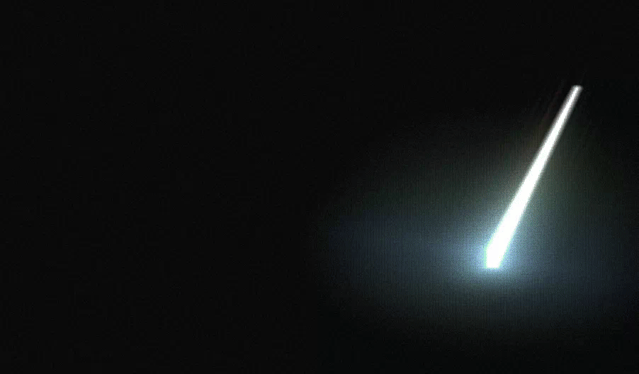

# Ghostty - In-game CRT shader
Shader for [Ghostty](https://ghostty.org/) with a focus on being usable while looking like a stylized CRT terminal from a modern video game.

## 🖥️ CRT effects


⚙️ **20 adjustable settings with accompanying descriptions and value ranges.**

🌀 **Curved display with subtle vignette to mimic mediocre CRT glass.**

🌈 **Minor color fringing and subtle RGB-separated ghost images.**

🎨 **Tint and non-linear color changes for aggressive colors.**

📺 **Scan lines and aperture grille for pixel-grid texture.**

✨ **Static noise and subtle flicker to enhance glows.**

💡 **Bloom to intensify and enlarge bright regions.**


## 🌠 Cursor effects
| Line (normal speed) | Line (slow motion) | Block (freeze frame) |
| - | - | - |
|  |  |  |

👀 **Trails appear only on large cursor jumps to help guide eyes, quick fade.**

✨ **Subtle and unobtrusive highlight upon small cursor movements.**

🎨 **Adaptive color blending between start and end cursor hues.**

⬜ **Supports line and block cursors, including transitions.**

⚙️ **User settings available for easy configuration.**

---

## 🛠️ Installation
> [!NOTE]
> The below instructions should work for most people, however, the correct locations are technically `$XDG_CONFIG_HOME/ghostty/shaders` and `$XDG_CONFIG_HOME/ghostty/config`.

#### 1. Download the shaders to `~/.config/ghostty/shaders`.
- Either, manually download:
    - [in-game-crt.glsl](https://raw.githubusercontent.com/sarphiv/ghostty-shader-in-game-crt/main/src/in-game-crt.glsl)
    - [in-game-crt-cursor.glsl](https://raw.githubusercontent.com/sarphiv/ghostty-shader-in-game-crt/main/src/in-game-crt-cursor.glsl)
- Or, run the following script in your shell:
```sh
url="https://raw.githubusercontent.com/sarphiv/ghostty-shader-in-game-crt/main/src"
dst="${XDG_CONFIG_HOME:-$HOME/.config}/ghostty/shaders"
mkdir -p "$dst"
curl -fsSL "$url/in-game-crt.glsl" -o "$dst/in-game-crt.glsl"
curl -fsSL "$url/in-game-crt-cursor.glsl" -o "$dst/in-game-crt-cursor.glsl"
```

#### 2. Replace existing `custom-shader` lines in `~/.config/ghostty/config`. Preserve the line ordering.
```yaml
custom-shader = shaders/in-game-crt-cursor.glsl
custom-shader = shaders/in-game-crt.glsl
```

#### 3. Done!
